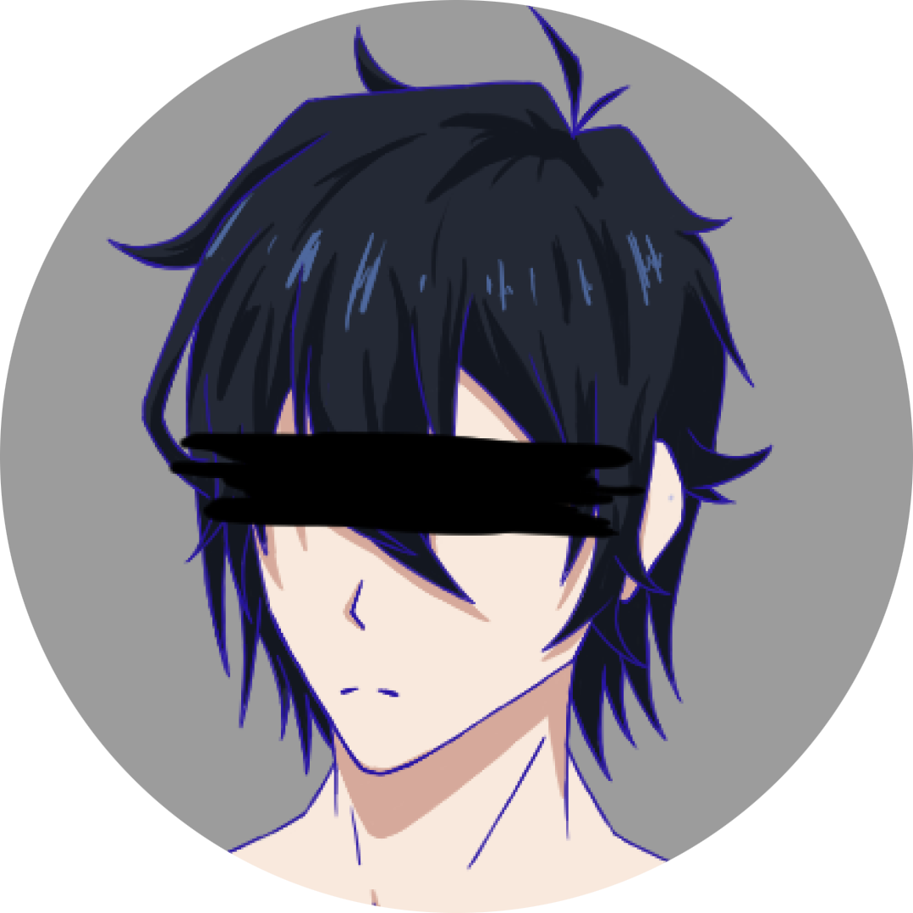
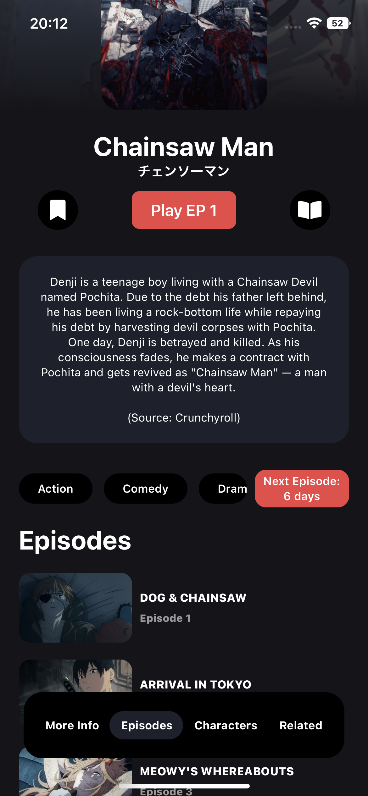

<!-- Improved compatibility of back to top link: See: https://github.com/othneildrew/Best-README-Template/pull/73 -->
<a name="readme-top"></a>
<!--
*** Thanks for checking out the Best-README-Template. If you have a suggestion
*** that would make this better, please fork the repo and create a pull request
*** or simply open an issue with the tag "enhancement".
*** Don't forget to give the project a star!
*** Thanks again! Now go create something AMAZING! :D
-->


<!-- PROJECT SHIELDS -->
<!--
*** I'm using markdown "reference style" links for readability.
*** Reference links are enclosed in brackets [ ] instead of parentheses ( ).
*** See the bottom of this document for the declaration of the reference variables
*** for contributors-url, forks-url, etc. This is an optional, concise syntax you may use.
*** https://www.markdownguide.org/basic-syntax/#reference-style-links
-->
[![Contributors][contributors-shield]][contributors-url]
[![Forks][forks-shield]][forks-url]
[![Stargazers][stars-shield]][stars-url]
[![Issues][issues-shield]][issues-url]
[![MIT License][license-shield]][license-url]


<!-- PROJECT LOGO -->
<br />
<div align="center">
  <a href="https://github.com/5H4D0WILA/InuStreamWebsite">
    
  </a>

<h3 align="center">Inu's Stream Swift</h3>

  <p align="center">
    An iOS version of my Website
    <br />
    <a href="https://github.com/5H4D0WILA/InuStreamWebsite"><strong>Explore the docs »</strong></a>
    <br />
    <br />
    <a href="https://github.com/5H4D0WILA/InuStreamWebsite">View Demo</a>
    ·
    <a href="https://github.com/5H4D0WILA/InuStreamWebsite/issues">Report Bug</a>
    ·
    <a href="https://github.com/5H4D0WILA/InuStreamWebsite/issues">Request Feature</a>
  </p>
</div>


<!-- TABLE OF CONTENTS -->
<details>
  <summary>Table of Contents</summary>
  <ol>
    <li>
      <a href="#about-the-project">About The Project</a>
      <ul>
        <li><a href="#built-with">Built With</a></li>
      </ul>
    </li>
    <li>
      <a href="#getting-started">Getting Started</a>
      <ul>
        <li><a href="#prerequisites">Prerequisites</a></li>
        <li><a href="#installation">Installation</a></li>
      </ul>
    </li>
    <li><a href="#usage">Usage</a></li>
    <li><a href="#roadmap">Roadmap</a></li>
    <li><a href="#contributing">Contributing</a></li>
    <li><a href="#license">License</a></li>
    <li><a href="#contact">Contact</a></li>
    <li><a href="#acknowledgments">Acknowledgments</a></li>
  </ol>
</details>


<!-- ABOUT THE PROJECT -->
## About The Project

<a href="https://github.com/5H4D0WILA/InuStreamSwift">
    <div style="width: 100%; display: flex; flex-direction: column; justify-content: center">
        <div style="width: 100%; display: flex; justify-content: center">
            
            
        </div>
        
    </div>
  </a>

The iOS app written in Swift is the native version of my website, allowing for easy anime watching with a modern and simple UI.<br>Right now the app requires iOS 16.0 or above.

<p align="right">(<a href="#readme-top">back to top</a>)</p>


### Built With

* [![Swift][Swift]][Swift-url]
*  <b>Consumet API</b>

<p align="right">(<a href="#readme-top">back to top</a>)</p>


<!-- GETTING STARTED -->
## Getting Started

IF you want to make edits to the app, or build it yourself, you can do so by following the instructions below<br>
But please give credit to everyone who helped create this project!

### Prerequisites

To open this project, you will need XCode 14.

### Installation

#### XCode

1. Clone the repo
   ```sh
   git clone https://github.com/5H4D0WILA/InuStreamSwift.git
   ```
2. Open the project in XCode
3. Run the app in a simulator or on real hardware

#### Altstore

1. Download and install AltServer from the [AltStore](https://altstore.io/) Website
2. Connect your phone to your pc
3. Install Altstore on your phone
4. Download the IPA from the [Releases](https://github.com/5H4D0WILA/InuStreamSwift/releases) on your iphone
5. Open the IPA in Altstore

<p align="right">(<a href="#readme-top">back to top</a>)</p>


<!-- USAGE EXAMPLES -->
## Usage

The app usage is pretty self-explanatory .-.

<p align="right">(<a href="#readme-top">back to top</a>)</p>

<!-- ROADMAP -->
## Roadmap

- [x] Info Page
- [x] Watch Page
    - [x] Modern video player
- [x] Basic Homepage
    - [x] Recent releases
    - [x] Continue Watching
    - [x] Trending anime
    - [ ] Popular anime
- [ ] Login
- [ ] Responsive UI

See the [open issues](https://github.com/5H4D0WILA/InuStreamWebsite/issues) for a full list of proposed features (and known issues).

<p align="right">(<a href="#readme-top">back to top</a>)</p>


<!-- CONTRIBUTING -->
## Contributing

Contributions are what make the open source community such an amazing place to learn, inspire, and create. Any contributions you make are **greatly appreciated**.

If you have a suggestion that would make this better, please fork the repo and create a pull request. You can also simply open an issue with the tag "enhancement".
Don't forget to give the project a star! Thanks again!

1. Fork the Project
2. Create your Feature Branch (`git checkout -b feature/AmazingFeature`)
3. Commit your Changes (`git commit -m 'Add some AmazingFeature'`)
4. Push to the Branch (`git push origin feature/AmazingFeature`)
5. Open a Pull Request

<p align="right">(<a href="#readme-top">back to top</a>)</p>


<!-- LICENSE -->
## License

Distributed under the MIT License. See `LICENSE.txt` for more information.

<p align="right">(<a href="#readme-top">back to top</a>)</p>


<!-- CONTACT -->
## Contact

Discord - Inumaki#8590

Project Link: https://github.com/5H4D0WILA/InuStreamSwift

<p align="right">(<a href="#readme-top">back to top</a>)</p>


<!-- ACKNOWLEDGMENTS -->
## Acknowledgments

* <b>[Riimuru](https://github.com/riimuru)</b> for the Consumet API
* <b>[NADESHIKON](https://github.com/NADESHIKON)</b> for helping me if i had issues (the meta tags for example)
* <b>[Othneil Drew](https://github.com/othneildrew)</b> for the template of this Readme
* <b>[Unknown Person](https://i.imgur.com/7Hz4LEi.jpeg)</b> for the homepage meta image. If you are the creator of the image, please contact me for removal/credit

<p align="right">(<a href="#readme-top">back to top</a>)</p>


<!-- MARKDOWN LINKS & IMAGES -->
<!-- https://www.markdownguide.org/basic-syntax/#reference-style-links -->
[contributors-shield]: https://img.shields.io/github/contributors/5H4D0WILA/InuStreamSwift.svg?style=for-the-badge
[contributors-url]: https://github.com/5H4D0WILA/InuStreamSwift/graphs/contributors
[forks-shield]: https://img.shields.io/github/forks/5H4D0WILA/InuStreamSwift.svg?style=for-the-badge
[forks-url]: https://github.com/5H4D0WILA/InuStreamSwift/network/members
[stars-shield]: https://img.shields.io/github/stars/5H4D0WILA/InuStreamSwift.svg?style=for-the-badge
[stars-url]: https://github.com/5H4D0WILA/InuStreamSwift/stargazers
[issues-shield]: https://img.shields.io/github/issues/5H4D0WILA/InuStreamSwift.svg?style=for-the-badge
[issues-url]: https://github.com/5H4D0WILA/InuStreamSwift/issues
[license-shield]: https://img.shields.io/github/license/5H4D0WILA/InuStreamSwift.svg?style=for-the-badge
[license-url]: https://github.com/5H4D0WILA/InuStreamSwift/blob/master/LICENSE.txt
[linkedin-shield]: https://img.shields.io/badge/-LinkedIn-black.svg?style=for-the-badge&logo=linkedin&colorB=555
[linkedin-url]: https://linkedin.com/in/linkedin_username
[product-screenshot]: images/screenshot.png
[Swift]: https://img.shields.io/badge/swiftui-000000?style=for-the-badge&logo=swiftui&logoColor=white
[Swift-url]: https://developer.apple.com/xcode/swiftui/
[React.js]: https://img.shields.io/badge/React-20232A?style=for-the-badge&logo=react&logoColor=61DAFB
[React-url]: https://reactjs.org/
[Vue.js]: https://img.shields.io/badge/Vue.js-35495E?style=for-the-badge&logo=vuedotjs&logoColor=4FC08D
[Vue-url]: https://vuejs.org/
[Angular.io]: https://img.shields.io/badge/Angular-DD0031?style=for-the-badge&logo=angular&logoColor=white
[Angular-url]: https://angular.io/
[Svelte.dev]: https://img.shields.io/badge/Svelte-4A4A55?style=for-the-badge&logo=svelte&logoColor=FF3E00
[Svelte-url]: https://svelte.dev/
[Laravel.com]: https://img.shields.io/badge/Laravel-FF2D20?style=for-the-badge&logo=laravel&logoColor=white
[Laravel-url]: https://laravel.com
[Bootstrap.com]: https://img.shields.io/badge/Bootstrap-563D7C?style=for-the-badge&logo=bootstrap&logoColor=white
[Bootstrap-url]: https://getbootstrap.com
[JQuery.com]: https://img.shields.io/badge/jQuery-0769AD?style=for-the-badge&logo=jquery&logoColor=white
[JQuery-url]: https://jquery.com 
